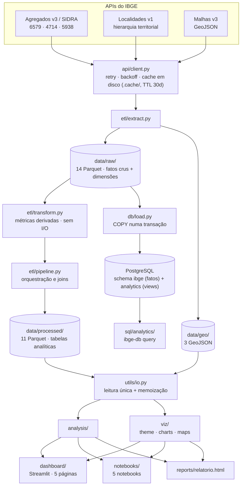

# Arquitetura

Como o projeto está organizado, por onde o dado passa, o que cada tecnologia
faz aqui e como reproduzir tudo do zero.

Para as peculiaridades das APIs do IBGE, ver **[API_NOTES.md](API_NOTES.md)**.
Para o modelo do PostgreSQL, os índices e as consultas, ver
**[BANCO.md](BANCO.md)**.

---

## 1. Visão geral

O projeto tem uma direção só: as APIs públicas do IBGE entram, e saem quatro
artefatos — dashboard, notebooks, relatório HTML e um banco PostgreSQL
consultável. Não há estado escondido entre as pontas: tudo que os consumidores
leem está em arquivo, e todo arquivo é reproduzível rodando o pipeline de novo.



Dois caminhos partem de `data/raw/`, e isso é deliberado:

- **O caminho analítico** (`transform` → `data/processed/`) produz tabelas
  denormalizadas e prontas para plotar. Repetem nome de município, UF e região
  em cada linha porque quem lê é pandas, e um join a cada gráfico seria pior.
- **O caminho do banco** (`db/load` → PostgreSQL) carrega o **cru**, na
  granularidade em que o SIDRA publica, e deixa toda métrica derivada como
  view. Recarregar os fatos não deixa nenhum número calculado desatualizado,
  porque nenhum número calculado está gravado.

Os dois lêem a mesma origem, então concordam por construção — e
[`tests/test_db.py`](../tests/test_db.py) verifica isso comparando o resultado
do SQL com o do pandas.

---

## 2. Camadas e regras de dependência

| Camada | Módulo | Responsabilidade | Pode importar |
|---|---|---|---|
| Configuração | `config.py` | caminhos, registro de agregados, limites da API, constantes territoriais | — |
| Transporte | `api/client.py` | sessão HTTP, retry/backoff, cache em disco | `config` |
| Endpoints | `api/agregados.py` · `localidades.py` · `malhas.py` | montam URLs, achatam a resposta, tratam sentinelas | `config`, `client` |
| Extração | `etl/extract.py` | chama os endpoints e persiste em `data/raw/` | `api`, `config` |
| Transformação | `etl/transform.py` | métricas derivadas — **sem I/O algum** | `config` |
| Orquestração | `etl/pipeline.py` | encadeia extract+transform, faz os joins, grava `data/processed/` | `etl`, `config` |
| Leitura | `utils/io.py` | única porta de entrada dos dados processados | `config`, `viz.maps` |
| Análise | `analysis/` | recortes e agregações de leitura — funções puras sobre DataFrame | `etl.transform` |
| Visual | `viz/theme.py` · `charts.py` · `maps.py` | paleta, gráficos Plotly, coropléticos | `config` |
| Persistência | `db/` | engine, DDL, carga via COPY, registro de consultas, CLI | `config`, `sql/` |
| Consumidores | `dashboard/` · `notebooks/` · `scripts/` | não contêm regra de negócio | `utils.io`, `analysis`, `viz` |

Três invariantes que o código mantém:

1. **`transform.py` não faz I/O.** Recebe DataFrame, devolve DataFrame. É o que
   torna as métricas testáveis sem rede e sem fixture de arquivo.
2. **Consumidor não lê Parquet direto.** Dashboard, notebooks e relatório
   passam todos por `utils.io.carregar()`, para que os três leiam exatamente os
   mesmos dados — e para que a reorientação das malhas aconteça num lugar só.
3. **Código IBGE é string, nunca número.** `_normalizar_id()` em
   [transform.py:23](../src/ibge_analytics/etl/transform.py#L23) e o `zfill(7)`
   em [load.py:119](../src/ibge_analytics/db/load.py#L119) existem porque
   `3550308` como int perde o zero à esquerda de municípios como `0500108`.

---

## 3. Fluxo ETL, etapa por etapa

Ponto de entrada: [`etl/pipeline.py`](../src/ibge_analytics/etl/pipeline.py)
(`python -m ibge_analytics.etl.pipeline` ou `ibge-etl`).

### 3.0 Dimensões — `extract.extrair_dimensoes()`

Antes de qualquer fato, a hierarquia territorial vem da API de Localidades v1:
5.571 municípios, 27 UFs e 5 regiões → `dim_municipios`, `dim_estados`,
`dim_regioes` em `data/raw/`.

Os agregados do SIDRA devolvem só código + um nome concatenado
(`"São Paulo (SP)"`, com formato que varia entre agregados), então o nome
canônico e a cadeia município → microrregião → mesorregião → UF → região vêm
sempre daqui. Municípios criados após a última revisão de microrregiões chegam
com `microrregiao` nulo e caem no ramo `regiao-imediata`
([localidades.py:46](../src/ibge_analytics/api/localidades.py#L46)).

### 3.1 Extração — `extract.py`

Cada fato é baixado nos quatro níveis territoriais e persistido cru:

| Agregado | Variáveis | Níveis | Janela | Saída em `data/raw/` |
|---|---|---|---|---|
| **6579** população estimada | 9324 | N1 N2 N3 N6 | 2001–2025 (21 anos publicados) | `pop_brasil` `pop_regioes` `pop_ufs` `pop_municipios` |
| **4714** Censo 2022 | 93, 6318, 614 | N1 N2 N3 N6 | 2022 | `censo_regioes` `censo_ufs` `censo_municipios` |
| **5938** PIB | 37, 513, 517, 6575, 525, 543 | N1 N2 N3 N6 | UF/Brasil 2002–2023 · **municípios 2010–2023** | `pib_brasil` `pib_regioes` `pib_ufs` `pib_municipios` |

Quatro decisões acontecem aqui, e todas são para não perder dado em silêncio:

- **Os anos vêm de `/periodos`, não de constantes.** `serie_de()` consulta os
  anos que o agregado realmente publica e descarta com aviso o que foi pedido
  além disso. O agregado 6579 não publica 2007, 2010, 2022 nem 2023 — e pedir um
  ano inexistente **não dá erro**, o dado só some da resposta.
- **Os lotes são planejados por orçamento de células.** O limite do servidor não
  é de períodos, é do produto `variáveis × períodos × localidades`; acima dele a
  resposta é HTTP 500 sem mensagem. `_planejar_lotes()`
  ([agregados.py:125](../src/ibge_analytics/api/agregados.py#L125)) fatia por
  período enquanto dá, e só fatia por variável quando um único período já
  estoura o teto de 33.000 células — o caso do PIB municipal, 6 variáveis ×
  5.570 municípios.
- **Sentinelas viram nulo.** O SIDRA usa `"..."`, `".."`, `"X"` e `"-"` em vez
  de `null`; `_para_numero()` converte todos para `None`, senão a coluna inteira
  viraria texto.
- **A janela municipal do PIB começa em 2010.** A série completa nos níveis
  agregados é barata; no nível municipal são 6 × 5.570 células por ano. A janela
  recente é o que as análises usam.

A resposta do SIDRA vem aninhada em quatro níveis
(`variável → resultados → séries → {ano: valor}`); `_achatar()` a converte em
linhas tidy e `serie_de()` pivota para o formato largo — uma coluna por
variável, com os nomes canônicos do registro em `config.py`.

**Malhas** (`extrair_malhas`, pulável com `--sem-malhas`): não existe endpoint
nacional de municípios, então as 27 UFs são baixadas e concatenadas numa única
`FeatureCollection`. Qualidade `minima` — a `maxima` passa de 10 MB e trava o
navegador.

### 3.2 Transformação — `transform.py`

Funções puras, aplicadas pelo pipeline:

| Função | O que produz | Detalhe que importa |
|---|---|---|
| `enriquecer_municipios` / `enriquecer_ufs` | fato + hierarquia territorial | descarta `localidade_nome` do SIDRA de propósito; `validate="many_to_one"` barra join que duplica linha |
| `calcular_densidade` | `densidade_calculada` | recalcula em vez de só usar a variável 614, para poder aplicar a mesma fórmula a qualquer ano; a coluna publicada fica ao lado, para conferência |
| `calcular_estrutura_setorial` | `part_vab_*` + `vab_total` | participação de cada setor no VAB |
| `calcular_crescimento` | `variacao_absoluta`, `variacao_pct`, `cagr_pct` | CAGR entre o primeiro e o último ano **de cada entidade** — a métrica correta quando as séries têm comprimentos diferentes |
| `classificar_crescimento` | `faixa_crescimento` | 5 faixas ancoradas no crescimento nacional (~0,5% a.a.) |
| `concentracao` | Gini, share do top 1%, 10% e 100 | Gini pela fórmula do ordenamento |
| `agregar_por_regiao` / `ordenar_regioes` | soma regional | ordem canônica do IBGE (norte→sul) via `Categorical` |

Duas armadilhas numéricas resolvidas aqui, ambas do tipo que devolve número
errado em vez de erro:

- `denominador_seguro()` anula zeros **antes** da divisão. `(a / b).where(b > 0)`
  avalia a divisão primeiro, e o pandas 3 levanta `ZeroDivisionError`.
- No CAGR, séries de um ponto só são mascaradas **depois** do cálculo: o
  expoente vira `NaN`, mas `1.0 ** NaN` é `1.0` em NumPy, e o município cairia
  calado na faixa "crescimento lento" em vez de ficar indefinido
  ([transform.py:155](../src/ibge_analytics/etl/transform.py#L155)).

### 3.3 Orquestração e painéis — `pipeline.py`

```
extrair_dimensoes()
   ├── construir_populacao()  → populacao_municipios · populacao_ufs
   │                            crescimento_municipios · crescimento_ufs
   ├── construir_censo()      → densidade_municipios · densidade_ufs
   ├── construir_pib()        → pib_municipios · pib_ufs
   ├── construir_painel()     → painel_municipios      (só se as 3 etapas rodaram)
   ├── construir_painel_uf()  → painel_ufs
   ├── construir_painel_regiao() → painel_regioes
   └── extrair_malhas()       → data/geo/*.geojson     (salvo --sem-malhas)
```

Os **painéis** são o produto final: um retrato por entidade no ano mais recente,
juntando população, área, densidade, PIB, estrutura setorial e ritmo de
crescimento numa linha só. É o que o dashboard e os mapas consomem.

O ponto delicado do painel é o **casamento de anos**. Três indicadores com três
vigências diferentes convivem na mesma linha:

- população estimada até **2025**;
- PIB total até **2023** (e VAB setorial só até 2021 — ver
  [API_NOTES §7](API_NOTES.md));
- área e densidade do **Censo 2022**.

Dividir o PIB de 2023 pela população de 2025 subestimaria o PIB per capita, e
como a população não publica 2022 nem 2023, o casamento ingênuo daria `NaN`.
`_ano_populacao_mais_proximo()` escolhe o ano de população publicado mais
próximo do ano do PIB, e o painel grava **as três referências como colunas**:
`ano_populacao`, `ano_pib` e `ano_populacao_pib`. Nenhuma leitura precisa
adivinhar de quando é o número que está vendo.

---

## 4. Dicionário de dados

### `data/raw/` — 14 Parquet, ~3,4 MB

Fatos como o SIDRA publica, com as colunas `localidade_id`, `localidade_nome`,
`nivel`, `ano` + uma coluna por variável do agregado. É a fonte da carga no
PostgreSQL. Reproduzível: está no `.gitignore`.

| Arquivo | Linhas | Colunas de valor |
|---|---:|---|
| `dim_municipios` | 5.571 | hierarquia município → região |
| `dim_estados` · `dim_regioes` | 27 · 5 | id, sigla, nome |
| `pop_municipios` | 116.908 | `populacao` |
| `pop_ufs` · `pop_regioes` · `pop_brasil` | 567 · 105 · 21 | `populacao` |
| `censo_municipios` · `censo_ufs` · `censo_regioes` | 5.570 · 27 · 5 | `populacao_censo`, `area_km2`, `densidade_hab_km2` |
| `pib_municipios` | 77.965 | `pib_mil_reais`, `vab_*`, `impostos_liquidos` |
| `pib_ufs` · `pib_regioes` · `pib_brasil` | 594 · 110 · 22 | idem |

### `data/processed/` — 11 Parquet, versionados

Tabelas analíticas denormalizadas: toda tabela municipal carrega
`municipio_id`, `municipio_nome`, `microrregiao_*`, `mesorregiao_*`, `uf_*` e
`regiao_*`; toda tabela estadual carrega `uf_*` e `regiao_*`. As colunas abaixo
são as **específicas** de cada tabela.

| Tabela | Linhas | Grão | Colunas específicas |
|---|---:|---|---|
| `populacao_municipios` | 116.908 | município × ano | `ano`, `populacao` |
| `populacao_ufs` | 567 | UF × ano | `ano`, `populacao` |
| `crescimento_municipios` | 5.571 | município | `ano_inicial`, `ano_final`, `valor_inicial`, `valor_final`, `variacao_absoluta`, `variacao_pct`, `cagr_pct`, `faixa_crescimento` |
| `crescimento_ufs` | 27 | UF | idem |
| `densidade_municipios` | 5.570 | município (Censo 2022) | `ano`, `populacao_censo`, `area_km2`, `densidade_hab_km2`, `densidade_calculada` |
| `densidade_ufs` | 27 | UF (Censo 2022) | idem |
| `pib_municipios` | 77.965 | município × ano | `ano`, `pib_mil_reais`, `vab_agropecuaria`, `vab_industria`, `vab_servicos`, `vab_administracao_publica`, `impostos_liquidos`, `vab_total`, `part_vab_*` |
| `pib_ufs` | 594 | UF × ano | idem |
| `painel_municipios` | 5.571 | município (retrato atual) | `populacao_atual`, `populacao_censo`, `populacao_ano_pib`, `area_km2`, `densidade_hab_km2`, `densidade_atual`, `pib_mil_reais`, `pib_per_capita`, `vab_*`, `part_vab_*`, `cagr_pct`, `variacao_pct`, `variacao_absoluta`, `faixa_crescimento`, `ano_populacao`, `ano_pib`, `ano_populacao_pib` |
| `painel_ufs` | 27 | UF | as do painel municipal + `part_pib_brasil`, `part_pop_brasil` |
| `painel_regioes` | 5 | região | somas regionais + `part_pib_brasil`, `part_pop_brasil`, `part_area_brasil`, `n_ufs` |

Unidades: `pib_mil_reais` e `vab_*` em **mil reais** a preços correntes (daí o
fator 1.000 no per capita); `part_*` em **pontos percentuais**; `cagr_pct` e
`variacao_pct` em **% ao ano** e **%** no período.

Duas contagens que parecem inconsistentes e não são: as tabelas de população
têm 5.571 municípios e as do Censo 2022 têm 5.570 — a diferença é Boa Esperança
do Norte (MT), instalado depois. Pelo mesmo motivo ele aparece sem PIB no
painel. Ver [API_NOTES §4](API_NOTES.md).

### `data/geo/` — 3 GeoJSON, ~3,7 MB

`municipios.geojson` (5.570 features), `ufs.geojson`, `regioes.geojson`. Cada
feature tem uma única propriedade, `codarea`, que é a chave de join com os
dados. Reorientados no carregamento — ver §6.

---

## 5. O caminho do PostgreSQL

Resumo aqui; o modelo completo, os 13 índices e as 11 consultas estão em
**[BANCO.md](BANCO.md)**.

```
data/raw/*.parquet ──> db/load.py ──COPY──> schema ibge     (14 tabelas de fato/dimensão)
                                                  │
                                            sql/03_views.sql
                                                  ▼
                                            schema analytics (7 views, 2 materializadas)
                                                  │
                                            sql/analytics/*.sql
                                                  ▼
                                            ibge-db query <nome>
```

- `db/engine.py` — URL vinda do ambiente, nunca do código: `.env` →
  `IBGE_DATABASE_URL` → variáveis do libpq → defaults. Driver fixado em
  `postgresql+psycopg` (psycopg 3).
- `db/schema.py` — executa os arquivos de `sql/` inteiros, como o psql faria.
  Não há migrações versionadas: o schema é reconstruível a partir do Parquet em
  segundos, então recriar é mais simples que manter histórico de ALTERs.
- `db/load.py` — substituição completa dentro de **uma transação**: lê todos os
  Parquet antes de abrir a transação (um arquivo faltando falha com o banco
  intacto), `TRUNCATE` de todas as tabelas num só comando, `COPY ... FROM STDIN`
  de cada uma, registro em `ibge.carga_log`, commit. Ou o banco fica com o
  snapshot inteiro, ou fica como estava.
- `db/queries.py` + `sql/analytics/` — consultas nomeadas e parametrizadas. O
  SQL nunca é montado por concatenação: fica em arquivo, para poder ser lido,
  colado no psql e revisado sem passar pelo Python.
- `db/cli.py` — o executável `ibge-db`.

---

## 6. Leitura, análise e visual

**`utils/io.py`** é a única porta de entrada dos dados processados, memoizada
com `lru_cache`. Se o Parquet não existe, levanta `DadosAusentesError` com o
comando exato que falta rodar — o dashboard usa isso para mostrar instrução em
vez de stack trace.

`carregar_malha()` aplica `viz.maps.reorientar_malha()` na entrada, e não no
consumidor. Motivo: o Plotly renderiza com d3-geo, que exige winding esférico —
o oposto do que o IBGE (e o RFC 7946) entrega. Sem inverter, o mapa sai com a
projeção inteira preenchida, **sem erro nenhum**. Centralizar a correção
garante que dashboard, notebooks e relatório recebam a geometria certa sem
precisar lembrar disso.

**`analysis/`** são funções puras de leitura sobre os painéis — rankings,
faixas de porte e densidade, concentração, estrutura setorial, comparação
regional. Nenhuma delas lê arquivo: recebem o DataFrame já carregado.

**`viz/`** aplica o sistema visual. A paleta é a de referência do sistema de
design, usada sem alteração de hex, e as restrições da validação dela são
respeitadas pelos gráficos: um único eixo y, legenda a partir de 2 séries,
rótulo direto ou tabela onde as cores de menor contraste aparecem, dispersão
facetada em vez de colorida. Nenhuma leitura depende só da cor. Escala
sequencial para magnitude; divergente só para crescimento, onde o zero é um
limiar real (crescer vs. encolher).

**Consumidores:**

| Artefato | Como se constrói | Observação |
|---|---|---|
| `dashboard/` | `streamlit run dashboard/app.py` | 5 páginas em `dashboard/pages/`, numeradas para fixar a ordem da navegação |
| `notebooks/` | `python scripts/build_notebooks.py` | os `.ipynb` são **artefatos gerados**; o conteúdo analítico vive no script, o que evita diffs ilegíveis e saídas commitadas |
| `reports/relatorio.html` | `python scripts/build_report.py` | HTML autocontido, com os gráficos Plotly embutidos |

---

## 7. Tecnologias

| Ferramenta | Papel aqui | Por que esta |
|---|---|---|
| **Python 3.11+** | linguagem | `X \| None`, `match`, tipagem sem `typing.Optional` |
| **requests** + urllib3 `Retry` | transporte HTTP | retry/backoff nos 5xx intermitentes do IBGE sem mascarar 4xx, que são erro nosso |
| **pandas 2.1+** | toda a manipulação tabular | o volume (117 mil linhas) cabe folgado em memória; Spark/Polars seria peso morto |
| **pyarrow** | formato de troca (Parquet) | preserva dtype entre execuções — CSV devolveria tudo como texto e perderia os nulos |
| **SQLAlchemy 2.0** | engine e conexão | só a camada de conexão; o SQL é escrito à mão em `sql/` |
| **psycopg 3** | driver PostgreSQL | expõe `cursor.copy()`, que é o que torna a carga rápida; psycopg2 não é dependência do projeto |
| **PostgreSQL** | persistência e camada analítica SQL | materialized views, `COPY`, `TRUNCATE` em grupo com FK — o schema é específico dele |
| **Plotly** | gráficos e coropléticos interativos | HTML autocontido sem servidor; mesmo objeto serve dashboard, notebook e relatório |
| **Folium** (Leaflet) | mapa navegável com tiles | onde o coroplético do Plotly não basta |
| **matplotlib** | figuras estáticas de `reports/figures/` | PNG para quem lê fora do navegador |
| **Streamlit** | dashboard | páginas em arquivo, sem front-end para manter |
| **pytest** | 287 testes | marcadores `network` e `postgres` isolam o que precisa de rede ou banco |
| **nbformat / nbconvert** | geração dos notebooks | notebook como artefato, não como fonte |

Sem framework de orquestração (Airflow, Dagster, dbt) de propósito: o pipeline
inteiro roda em ~3 minutos num comando e não tem agendamento nem dependência
externa. Um orquestrador aqui seria mais infraestrutura para manter do que
pipeline para rodar.

---

## 8. Reproduzir localmente

### Pré-requisitos

- Python 3.11 ou superior
- ~50 MB de disco para dados e cache
- conexão com a internet na primeira execução
- PostgreSQL 14+ **apenas** para a parte do banco (§8.4) — todo o resto funciona
  sem ele

### 8.1 Instalação

```bash
git clone <repo> && cd ibge-analytics
python -m venv .venv
source .venv/bin/activate        # Windows: .venv\Scripts\activate
pip install -e ".[dev]"
```

O `-e` instala em modo editável e registra os executáveis `ibge-etl` e
`ibge-db`.

### 8.2 Pipeline

```bash
python -m ibge_analytics.etl.pipeline          # ou: ibge-etl
```

Primeira execução: **~3 minutos** (a API é lenta em nível municipal — 5 a 20 s
por requisição). As seguintes usam o cache de `.cache/`, com TTL de 30 dias, e
levam segundos.

Ao final devem existir 14 Parquet em `data/raw/`, 11 em `data/processed/` e 3
GeoJSON em `data/geo/`.

Variações:

```bash
python -m ibge_analytics.etl.pipeline --sem-malhas        # pula o GeoJSON (~40 s a menos)
python -m ibge_analytics.etl.pipeline --etapas populacao  # só uma etapa (não gera os painéis)
python -m ibge_analytics.etl.pipeline -v                  # log com cada requisição e cada lote
```

> Os painéis só são gerados quando as três etapas (`populacao`, `censo`, `pib`)
> rodam na mesma execução — eles cruzam as três.

### 8.3 Artefatos

```bash
streamlit run dashboard/app.py       # http://localhost:8501
python scripts/build_report.py       # -> reports/relatorio.html
python scripts/build_notebooks.py    # (re)gera os .ipynb
jupyter lab notebooks/
```

### 8.4 Banco (opcional)

```bash
cp .env.example .env       # preencha PGPASSWORD; porta 5432 (3306 é MySQL)
ibge-db sync               # cria banco + schema + carga + refresh + qualidade — ~10 s
ibge-db check              # inventário e verificação
```

`sync` é idempotente: pode ser repetido a cada nova execução do pipeline.

Consultas:

```bash
ibge-db queries                                      # lista as 11
ibge-db query concentracao
ibge-db query top_municipios --metrica pib --limite 10
ibge-db query serie_uf --uf SP --csv serie-sp.csv
ibge-db query top_municipios --sql                   # mostra o SQL sem executar
ibge-db explain concentracao                         # EXPLAIN ANALYZE
```

### 8.5 Testes

```bash
pytest                # 278 offline
pytest -m network     # + 3 contra a API real
pytest -m postgres    # + 6 de integração com o banco
```

Os testes de banco são pulados quando não há conexão, e os de dados
(`test_dados.py`, que valida os Parquet de verdade) quando o pipeline ainda não
rodou. Nenhuma execução falha por ausência de infraestrutura.

### 8.6 Quando algo dá errado

| Sintoma | Causa | O que fazer |
|---|---|---|
| `DadosAusentesError` no dashboard ou no relatório | pipeline não rodou | `python -m ibge_analytics.etl.pipeline` |
| `ParquetAusenteError` no `ibge-db load` | idem — a carga lê `data/raw/` | idem |
| `IBGEAPIError: HTTP 500` | resposta grande demais, ou instabilidade da API | tente de novo; se for reprodutível, baixe `MAX_CELULAS_POR_REQUISICAO` em [config.py:159](../src/ibge_analytics/config.py#L159) |
| Coluna de um ano inteiro vazia | ano pedido que a API não publica | o log traz `não publica ... — anos ignorados`; ver [API_NOTES §2](API_NOTES.md) |
| Mapa sai com a projeção inteira preenchida | malha não reorientada | leia sempre por `io.carregar_malha()`, nunca `json.load` direto |
| `DatabaseIndisponivelError` | `.env` ausente ou errado | a própria mensagem traz o `.env` mínimo; confira a porta 5432 |
| Dados velhos após atualização do IBGE | cache de 30 dias | apague `.cache/` e rode o pipeline de novo |
| `UnicodeEncodeError` no console do Windows | console em cp1252 | já tratado em `db/cli.py`; se ocorrer em outro script, `chcp 65001` |

---

## 9. Estender

**Novo indicador de um agregado do SIDRA:**

1. Declare um `Agregado` em [`config.py`](../src/ibge_analytics/config.py) com
   id, variáveis e níveis — os nomes das variáveis viram nomes de coluna.
2. Acrescente uma `extrair_*()` em `etl/extract.py`.
3. Se houver métrica derivada, escreva-a em `etl/transform.py` — função pura.
4. Encadeie uma `construir_*()` em `etl/pipeline.py` e registre a etapa no
   `--etapas`.
5. Registre a tabela em `utils/io.TABELAS` para ela aparecer no inventário.
6. Para persistir no banco: uma `Fonte` em `db/load.FONTES` e a tabela em
   `sql/01_schema.sql`.

**Nova consulta SQL:** crie `sql/analytics/<nome>.sql` e registre em
`db/queries.CONSULTAS` — o `ibge-db query <nome>` passa a aceitá-la
automaticamente.

**Nova página do dashboard:** um arquivo numerado em `dashboard/pages/`,
lendo por `utils.io` e plotando por `viz.charts`.

Em todos os casos, o teste correspondente vai no arquivo de `tests/` que já
cobre aquela camada — a tabela de cobertura está no
[README](../README.md#testes).
